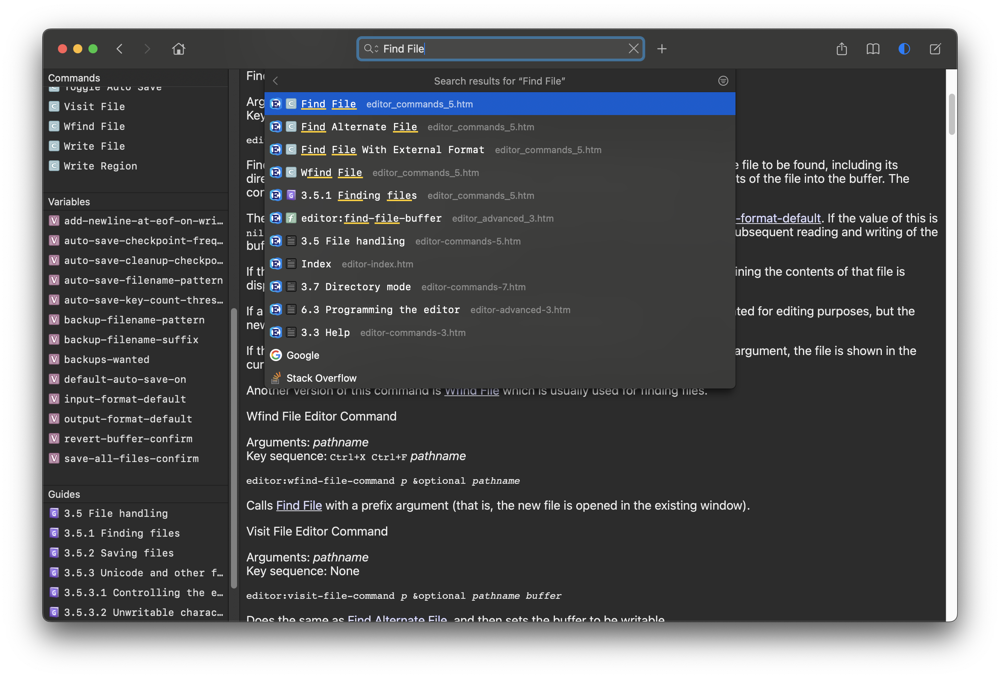

# LW-Dash

This is yet another tool to convert LispWorks documentations to the
[Dash](https://kapeli.com/dash) docset. It's based on
[dash-capi](https://codeberg.org/fourier/dash-capi/) by Alexey
Veretennikov, but with several enhancements:

- Support converting all kinds of LispWorks documents (lw, ide, editor, etc.)
- Notating symbols types based on their description in menu (Methods, Editor Commands, etc.)
- Support searching class accessors embedded in the class reference (like `capi:element-parent`)
- Support searching entries that embedded in the Guides (like Editor Commands)
- Support searching sub-headings inside a Guide page
- Support Table of Contents
- Generate meaningful icons for docsets...

## Copyright

We keep the MIT licence with dash-capi. Some codes are written by
April & May (us), and some are copied from dash-capi.

## Screenshot

